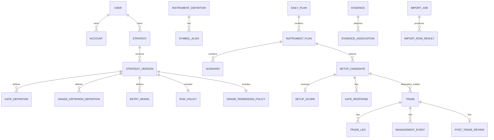

# Conceptual Domain and Data Model

## Invariants

- Published strategy definitions are immutable; plans, candidates, gate assessments, scores, and trades retain the applicable strategy-version snapshot.
- Candidate lifecycle and disposition are separate. A linked trade sets disposition `Traded`; it does not create a `Converted` lifecycle state.
- Gate result, diagnostic completion, and lock state are independent dimensions.
- A candidate has zero-or-one score. Rejected/expired candidates need no score.
- Every restricted override, correction, amendment, publish, import decision, and deletion action is auditable.

## Entity catalogue

| Entity | Purpose; key / required fields | Relationships, lifecycle, audit and archive |
|---|---|---|
| User | Owner identity/profile: ID, auth identity, timezone, preferences. Identity/timezone required. | Owns records; active/disabled/deletion requested. Audit consent/auth/export/delete. |
| Strategy / Strategy Version | Playbook and immutable revision: name, owner, number, status, effective date, change summary, rule status/source/conflict reference. | Draft→Published→Superseded/Archived; published immutable. Source-Backed/Unresolved rules cannot be presented as owner-approved doctrine. |
| Gate Definition | Current published strategy versions define 14 mandatory gates. Historical versions may retain 15 keys, including the former mandatory 2R gate. Each gate stores key, prompt, Yes/No criteria, explicit N/A exception situation if any, evidence requirement, rule refs/order. | No general N/A. Exception needs documented situation + response reason and cannot bypass mandatory condition. Snapshot in response. Realistic 2R is now an optional confluence, not current mandatory rejection logic. |
| Grade Criterion Definition | Six quality rubrics: key, label, score-1 and score-2 criteria, help. | 1=valid/acceptable; 2=strong/aligned. Gates establish validity; no 0 or weighting. Versioned. |
| Entry Model | EM1–4/extensible doctrine: condition, context, location, confirmation, entry/stop/target/invalidation/avoid rules and examples. | Owner-required doctrine remains blank until approved; versioned and snapshotted. |
| Risk / Grade Permission Policy | Limits/minimum R and grade actions: A+/A permit, B review-only, C/Rejected block; override requirements. | Versioned; snapshot at qualification/trade. Restricted override reason and basis audited. |
| Instrument Definition / Symbol Alias | Symbol, aliases, asset class, venue, currencies, tick/pip size/value/multiplier, quantity convention, precision, fee/session hints, execution permission. | Strategy-version live allow-list is XAUUSD, EURUSD, GBPUSD, USDJPY, USDCHF, USDCAD, AUDUSD, NZDUSD; analysis-only symbols cannot execute. Alias maps imports. |
| Account | Name, broker/type, currency, balances, limits, timezone/rollover, status. | Owns plans/trades/imports. Active→Inactive→Archived→Deletion flow; historic references retained. |
| Daily Plan / Instrument Plan / Scenario | Dated account/version plan with selected Asia/London/New York AM session classifications; per-instrument thesis; A/B/C actions/confirmation/invalidation. | Trader selects classification manually; it is independent from timestamp/IST display and has no fixed hours or DST logic. Plan snapshots downstream. |
| Setup Candidate | Potential setup: source, version, instrument, direction/archetype, `lifecycle`, `disposition`, discovered time, plan/scenario links. | Lifecycle={Preparing,Qualified,Rejected,Expired,Archived}; Disposition={None,Traded,Missed,CorrectNoTrade,Cancelled}. Has responses for its referenced strategy version's active mandatory gates, optional confluence snapshots, 0..1 score, 0..n trade links. |
| Gate Assessment / Response | Header dimensions: `result={InProgress,Passed,Rejected}`, `diagnosticCompletion={Partial,Complete}`, `lockState={Draft,Locked}`. Responses store definition snapshot, answer, permitted N/A reason, evidence/time, first/additional failures. | First No rejects. Current pass requires all active mandatory gates except optional confluences; historical v1 pass required 15 Yes. Fast save may leave diagnostics Partial. Correction retains original, corrected value/reason/audit. |
| Setup Score | Six 1-or-2 scores, total/calculated grade, confidence/note, correction/lock time. | Zero-or-one; only Passed gate result; C=6/B=7–8/A=9–10/A+=11–12. Grade immutable at trade creation; corrections append. |
| No-Trade Decision / Missed Setup | Decision links, reason/provenance/evidence. No-trade has Pending/Confirmed confirmation/reviewer/criteria. Missed has intended grade provenance and estimated Executed/Planned/Maximum R plus basis. | No-trade begins Pending, may confirm only end-day/weekly after checks. Skipped valid permitted setup changes disposition to Missed. Hindsight excluded from prospective measures. |
| Trade / Trade Leg | Idea-level execution: account/version/instrument/direction/source/status/restriction basis, manual session classification/plan variance, daily thesis ordinal/recovery-revenge intent and timestamped legs. | A partial fill starts one of two daily trade theses; planned add-ons and their partial fills remain in the thesis. Third historical thesis is restricted/process violation. Stores three R values. |
| Management Event | Post-entry action/time/price/quantity/stop/initial risk/reason/planned flag/screenshot and pre-add total-risk calculation. | Append-only. Add is invalid if losing/unsecured, after invalidation, or total worst-case risk would exceed 2%; unplanned is also a process violation. Only new-entry-model requirement remains unresolved. Additions/widening update maximum-risk denominator only. |
| Evidence / Association | Secure file ref, type/checksum/upload/capture time/caption/annotation and polymorphic target. | Can attach to plan, candidate, gate, score, trade, event, review, missed/no-trade and library. Access/removal/quarantine audited. |
| Review / Mistake / Code | Versioned questions, classification/grades/lesson; 17 codes; observed impact and counterfactual estimate/basis. | Review separate from trade. Complete locks snapshot; renames preserve historic code label. |
| Library / Tag / Saved View / Dashboard Preference | Curation reference, generic tag joins, stored query and layout/widget/unit preference. | Owner/private; curation never changes source evidence. |
| Import Mapping / Job / Row Result | Mapping template, file/account/status, normalisation, duplicate action, exception/reconciliation result. | Idempotent job/row audit. Imported context-missing never invents strategy data. |
| Currency Conversion Snapshot | Pair, rate/source/time, applied amount/base/report currency/method. | Used for currency aggregates only; never needed for any R denominator. |
| Weekly Review / Objective / Audit Event | Filtered metric/reflection snapshot/objective and append-only action history. | Publish/complete locks; amendments preserve originals. Audit records actor/time/reason/before/after redacted values. |

## Archive/deletion

Archive hides from operational defaults but retains historical links. Deletion offers export, confirms scope, revokes evidence access, and deletes/anonymises according to approved retention policy; it never silently cascade-deletes trades or audit history.
