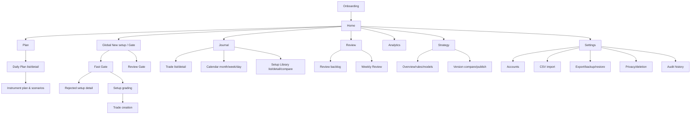

# Information Architecture

## Navigation alternatives evaluated

| Alternative | Structure | Benefit | Risk |
|---|---|---|---|
| A. Ten primary items (current draft) | Dashboard, Daily Plan, Pre-Entry Gate, Trades, Calendar, Strategy, Library, Analytics, Weekly Review, Settings. | Each capability is explicit. | Gate is a time-critical contextual action, not a browsing destination; review items fragment navigation. |
| B. Reduced, recommended | **Home; Plan; Journal (Trades, Calendar, Setup Library); Review (Backlog, Weekly Review); Analytics; Strategy; Settings.** `New setup / Gate` is persistent global action + keyboard shortcut, contextualised to active plan. | Lower navigation load; matches Plan → qualify → journal → review cadence; Gate remains one action away. | Needs shortcut/CTA discoverability and prototype validation. |

**Approved direction:** Alternative B. Primary navigation is Home, Plan, Journal, Review, Analytics, Strategy, Settings. Show global `New setup` on every authenticated desktop header and mobile primary action; use `G` only when focus is not inside a text input. It opens Fast Gate with active plan/account preselected; fallback asks for account/instrument.

## Recommended sitemap

## Navigation rules and page hierarchy

| Area | Secondary navigation / persistent context |
|---|---|
| Home | Global date/account/unit/scope filters; current weekly objective, active plan/trades, review backlog, new setup CTA. |
| Plan | Plan list, date picker, plan detail, instrument tabs, scenario sections; current account/version/status. |
| Gate | Fast/Review mode; candidate context, progress, linked plan; no persistent left-nav selection required. |
| Journal | Setup candidates, Trades, Calendar, Setup Library; global filters and saved views. Trade detail has Overview, plan snapshot, legs, management, evidence, review, audit. |
| Review | Post-trade reviews, daily review, backlog and Weekly Review; due state, account/week filter, review completion coverage. |
| Analytics | Overview and report detail; filter chips, N/exclusions, metric definition, table/chart toggle. |
| Strategy | Overview, rule editor, entry models, risk/permission policy, review questions, mistake codes, versions. |
| Settings | Accounts; import jobs/mappings; export/backup/restore; privacy/deletion; audit history; preferences. |

## Record relationships and contextual links

A plan links to instrument plans/scenarios; a candidate snapshots plan/version context and can link to gate assessment, zero-or-one score, no-trade/missed decision, and optional trade(s). Trade is independently creatable (manual/imported) and links legs/events/evidence/review; review completion never changes trade status. All primary records expose backlinks: candidate ↔ plan/scenario/trade, trade ↔ plan/candidate/review/library, calendar day ↔ decisions/evidence, and audit history ↔ every material action.

## Search, filters, and saved views

Global search covers IDs, symbols/aliases, account, model, tag, mistake code, review lesson, plan title, and screenshot caption; no OCR in v1. Global filters are date range, account, strategy version, instrument, session, and validity scope. Page filters add outcome, grades, archetype, profile/zone, review/evidence, source, gate-assessment completeness, provenance, and mistake. OR applies within a filter, AND across filters; UI says so. Saved View persists query/filter/sort/group/columns per owner, never content or permissions. A result always exposes source, status, date, and context-missing/reconciliation state.
