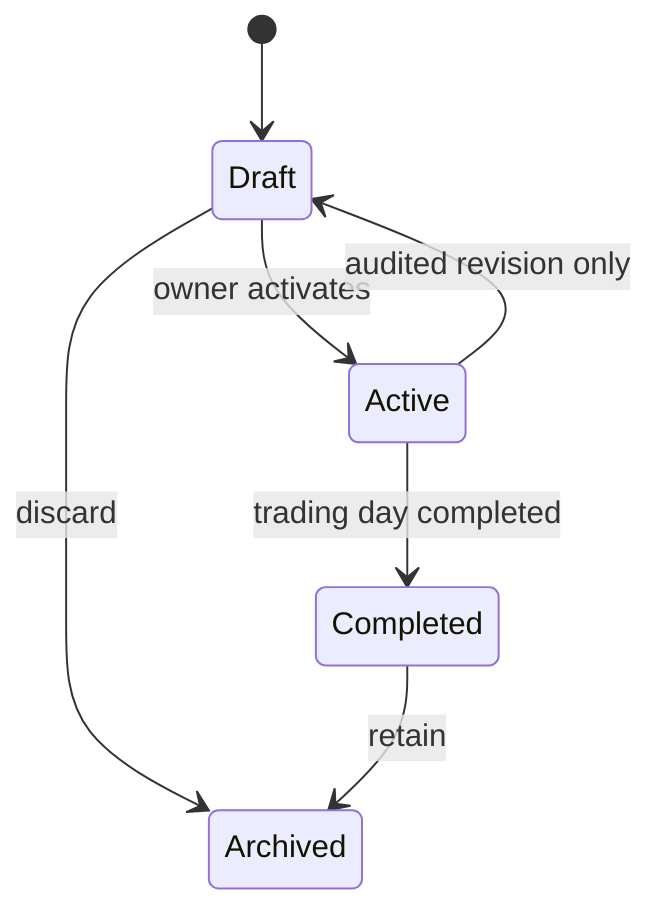
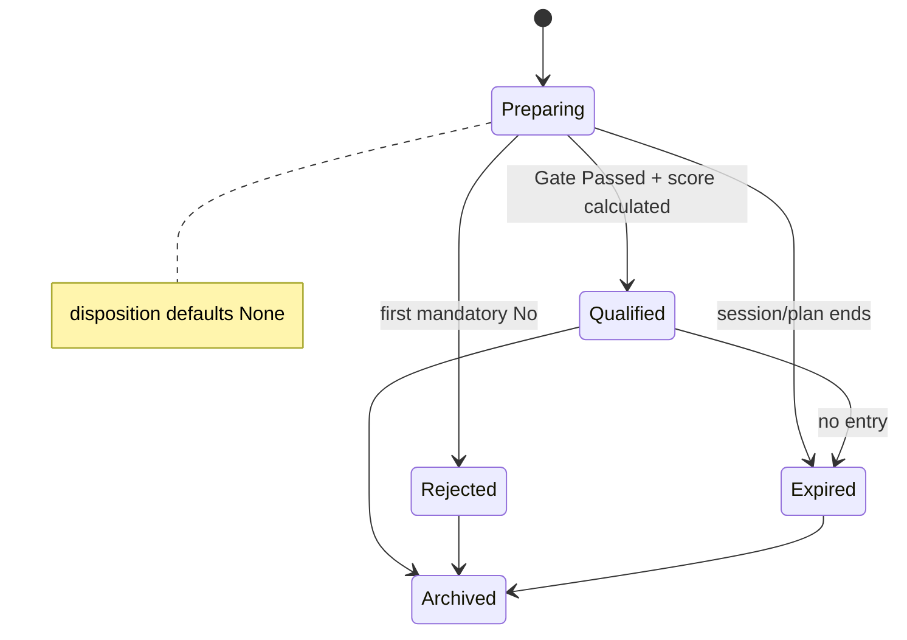
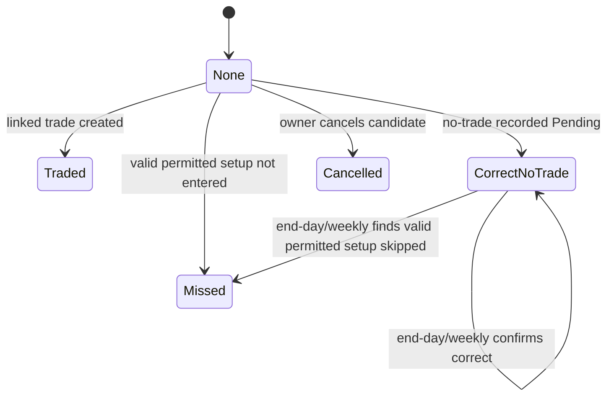
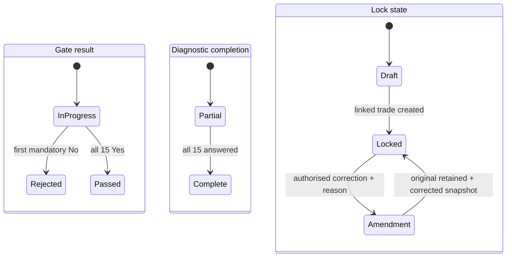
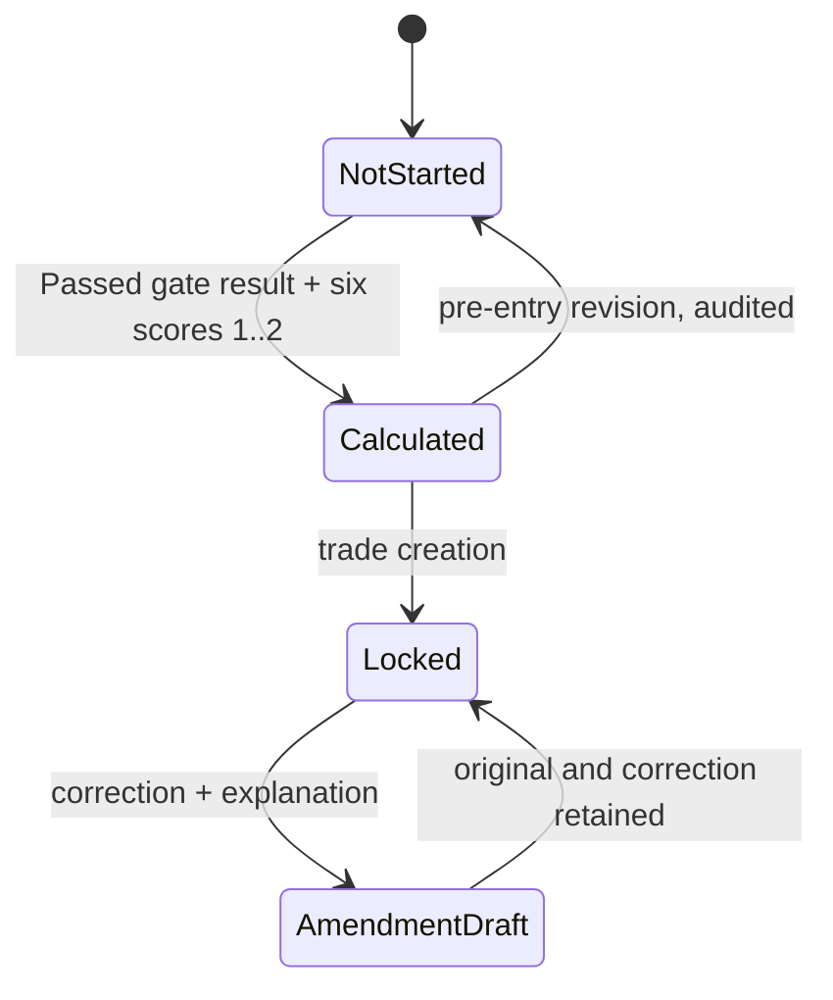
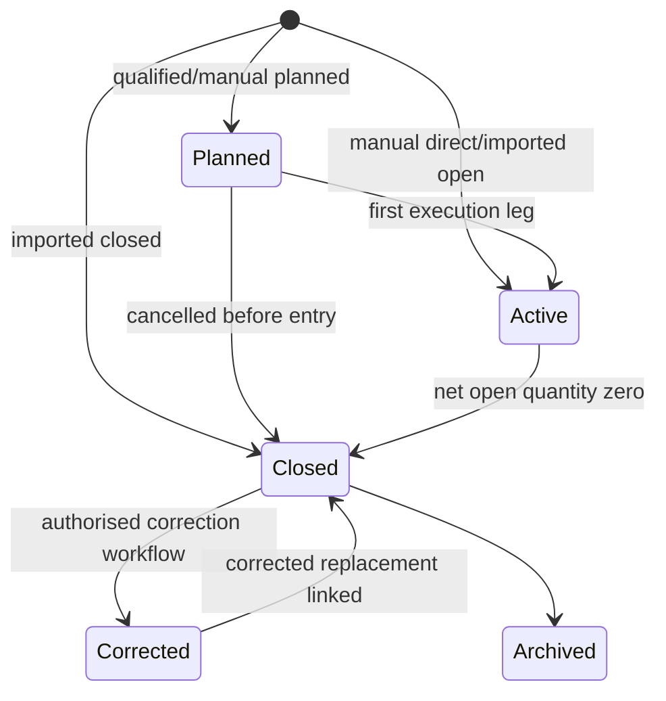
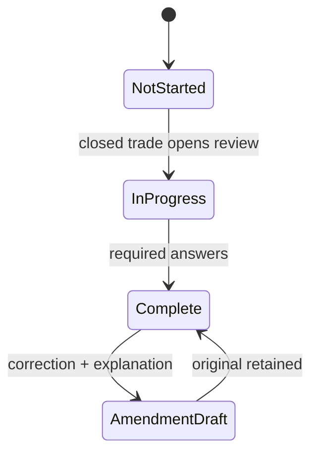
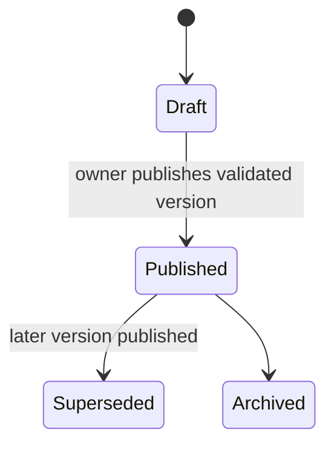

# Aggregate Lifecycle, Terminology, and Permission Model

## Canonical status matrix

Each row is an independent dimension or aggregate. A trade never becomes “reviewed”; its Post-Trade Review does. `Archived` is retention only.

| Aggregate/dimension | Canonical values | Lock/amendment rule |
|---|---|---|
| Daily Plan | Draft → Active → Completed → Archived | Active revisions audit and snapshot downstream context. |
| Instrument Plan | Draft → Active → Superseded/Inactive → Archived | Snapshot when candidate created; later edits do not rewrite snapshots. |
| Setup Candidate lifecycle | Preparing → Qualified / Rejected / Expired → Archived | Lifecycle is distinct from disposition. A linked trade does not change lifecycle to “Converted.” |
| Setup Candidate disposition | None; Traded; Missed; Correct No-Trade; Cancelled | Separate field. Correct No-Trade has its own Pending/Confirmed confirmation status. |
| Gate result | In Progress; Passed; Rejected | First mandatory No immediately sets Rejected; it cannot later pass. |
| Gate diagnostic completion | Partial; Complete | Complete only when all 15 responses are answered; after first No, remaining answers are optional diagnostics. |
| Gate lock state | Draft; Locked | Trade creation locks gate snapshot; corrections preserve original, create audit, corrected value and explanation. |
| Setup Score | Not started → Calculated → Locked | Only Passed gate result can score; six values are 1 or 2; correction is an amended snapshot. |
| Trade | Planned → Active → Closed → Archived / Corrected reference | Manual/imported trades may start Active/Closed without candidate. |
| Post-Trade Review | Not started → In progress → Complete | Complete locks review snapshot; amendment retains original. |
| Weekly Review / Objective | Draft → In progress → Published → Archived; objective Draft → Active → Completed/Cancelled | Publish locks metrics/filter snapshot. |
| Strategy Version | Draft → Published → Superseded/Archived | Published content immutable. |
| Import Job | Uploaded → Mapped → Previewed → Processing → Completed/Partial/Failed → Retained | Mapping/row decisions auditable; no silent duplicate. |
| Account | Active → Inactive → Archived → Deletion requested → Deleted/anonymised | Historical trade/account snapshots survive archive. |

**Canonical restriction term:** `Restricted setup taken anyway` is the permanent trade classification for an overridden Rejected, C, or restricted-B setup. Store `restrictionBasis={Rejected,C,RestrictedB}` and render “Rejected setup taken anyway” when the basis is Rejected. Result never changes this classification.

## Daily plan



## Setup candidate lifecycle and disposition





## Gate assessment: result, diagnostic completion, and lock



No general N/A control exists. An N/A can be selected only if that Gate Definition in the strategy version names the exact situation; reason is mandatory and the response cannot bypass a mandatory condition. Fast Mode may save immediately after first No. Diagnostic completion never changes Rejected to Passed.

## Setup score and trade





Default permission: A+/A permitted; B journal/review-only; C and Rejected not permitted. A manual historical record is never blocked. Trade creation for restricted B/C/Rejected requires override reason, preserves failed rules/grade and assigns `Restricted setup taken anyway` with basis. All three R values are retained: Executed R (default), Planned-capital R, and Maximum-risk R.

**Batch A execution controls:** only XAUUSD, EURUSD, GBPUSD, USDJPY, USDCHF, USDCAD, AUDUSD and NZDUSD may receive live-execution permission. Daily Plan and trade records manually select Asia/London/New York AM as planning/analytics labels; no session clock, DST rule or timestamp-based rejection exists, and an open trade may span sessions. Two executed trade theses end live-entry permission for the trading day; a partial first fill starts a thesis, no-fill cancellation does not, and planned add-ons/partial add fills remain in it. A third historical thesis is restricted with process violation and recovery/revenge-intent field. Adds must have been planned, cannot be losing/unsecured or post-invalidation, and are automatically invalid above 2% total worst-case risk; every leg preserves its own entry, stop, risk, screenshot, reason and planned status. Unplanned adds remain violations. Only the new-entry-model requirement is unresolved.

## Review, strategy, import, and account





```mermaid
stateDiagram-v2
 [*] --> Uploaded
 Uploaded --> Mapped --> Previewed --> Processing
 Processing --> Completed
 Processing --> Partial
 Processing --> Failed
 Partial --> Processing: resolve exceptions
 Completed --> Retained
```

```mermaid
stateDiagram-v2
 [*] --> Active
 Active --> Inactive --> Archived
 Inactive --> Active
 Archived --> DeletionRequested --> ExportReady --> DeletedOrAnonymised
```

Only the owner acts on their records in v1. Every lock, override, amendment, publish, import decision, archive, and deletion action is audited with actor, timestamp, reason, original and corrected value where applicable.

**Doctrine publication guard:** a strategy version may be technically Published for future draft capture only when its rule status/source references are retained. It must not be marked `Owner-approved doctrine` while any blocking owner question remains unanswered; Source-Backed Draft and Unresolved rules remain visibly labelled in the gate/playbook.
