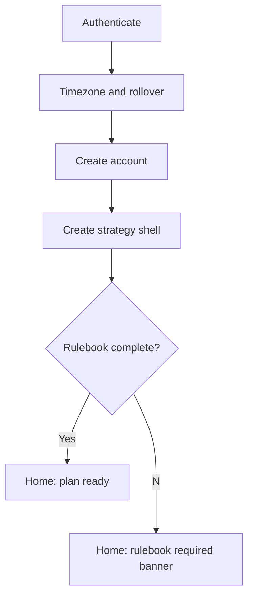
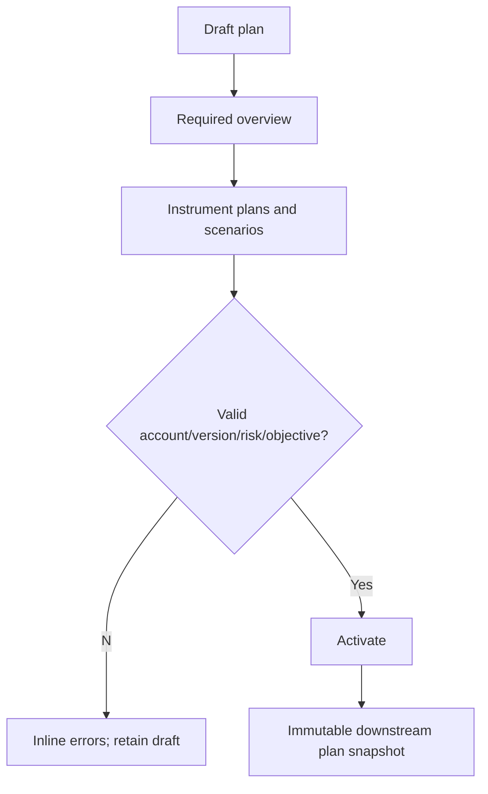
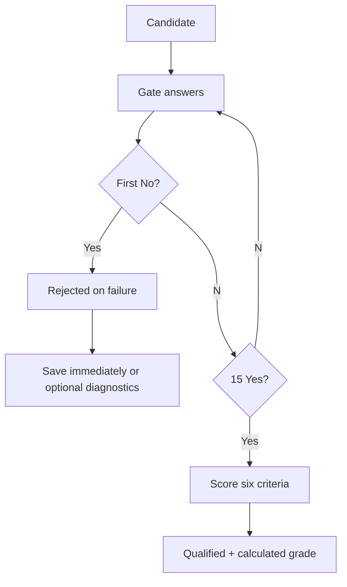
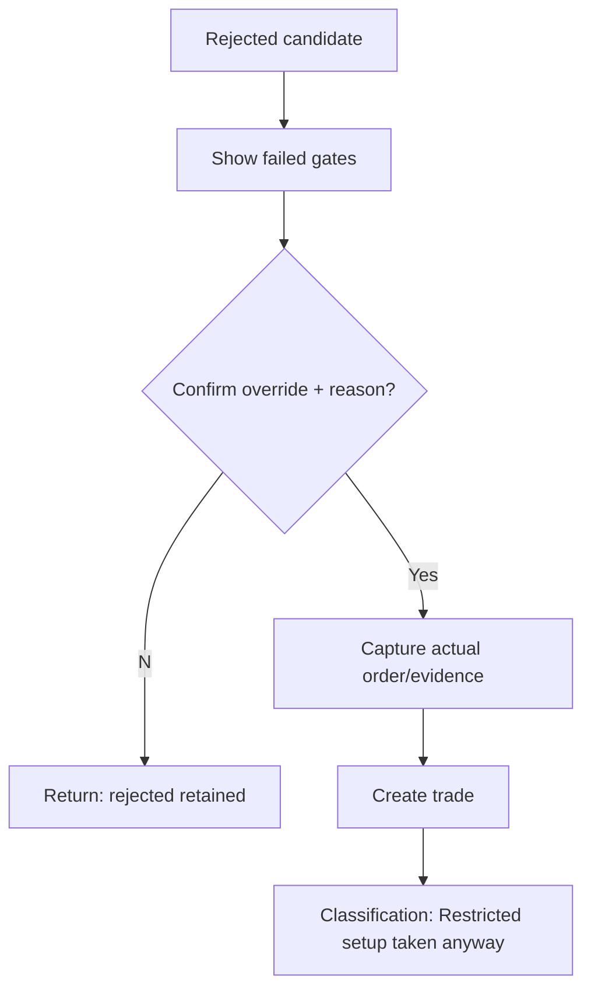
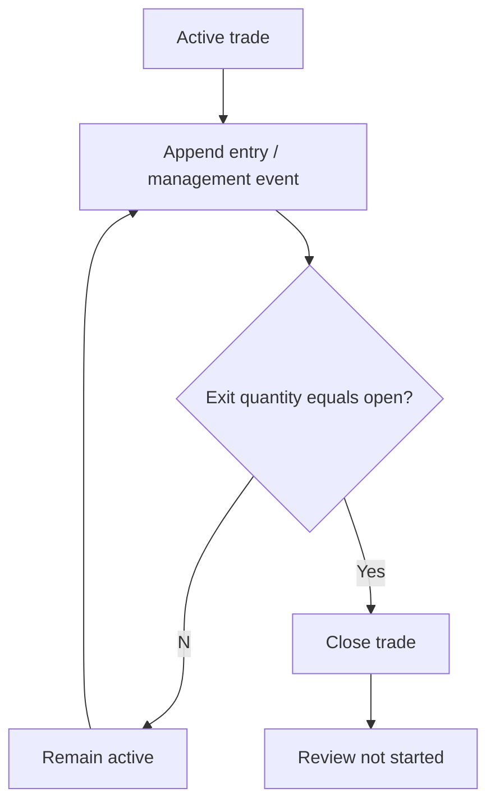
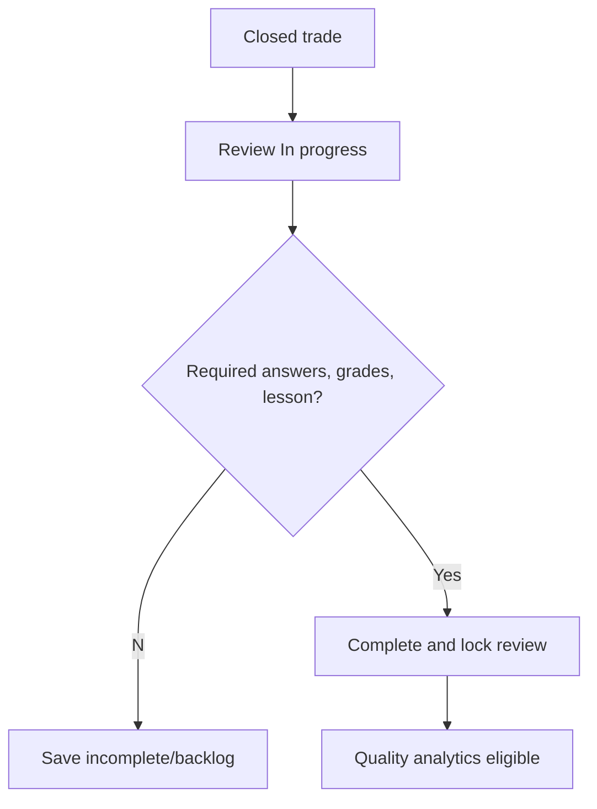
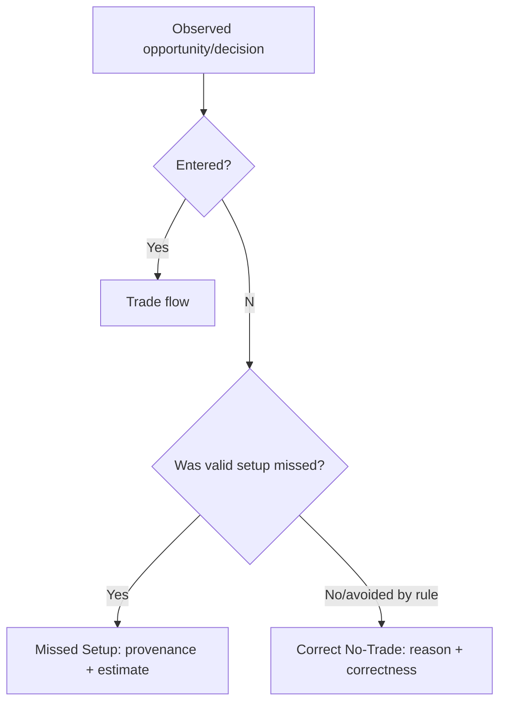
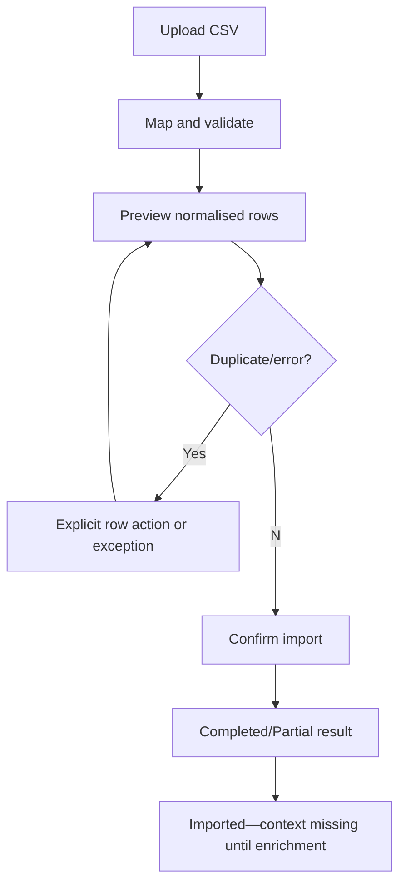

# End-to-End User Flows

## Shared failure and cancellation rules

All flows persist a clearly labelled local draft before network work where the record is not yet locked. Network failure never changes a Yes to No, creates duplicate import rows, or discards typed text; retry is idempotent. Cancel closes unsaved overlays after a discard/save-draft choice and never changes a locked record. Every material save/transition records actor, UTC time, source, before/after snapshot where relevant, and reason for override/amendment.

Rulebook-dependent flows show rule status/source. A SOURCE-BACKED DRAFT can be captured as trader-attested context but never silently promoted to OWNER-APPROVED or automated as a final personal rule; unresolved doctrine routes to the linked owner question.

**Batch A flow guard:** Daily Plan and trade records manually select Asia/London/New York AM session labels for planning and analytics; timestamps never cause a session-boundary rejection. A partial first fill starts one executed daily trade thesis; no-fill cancellation does not, and planned add-ons remain within that thesis. The third live thesis is blocked, but historical recording requires `Restricted setup taken anyway`, a process-rule violation and recovery/revenge-intent answer. Before an addition, require planned status, a secured/non-losing original position, no thesis invalidation and recalculated complete-position worst-case risk at or below 2%; save each leg with its own risk/evidence and flag unplanned adds as violations. Only Q-A43 remains open.

## 1. First-time onboarding

**Preconditions/entry:** authenticated new owner; entry post-signup or Resume. **Happy path:** 1) set timezone/rollover; 2) create account; 3) name strategy; 4) acknowledge unfinished rulebook; 5) land Home checklist. **Branches:** existing account imports preferences; user may defer optional tutorial, not mandatory account/timezone. **Validation/network/cancel:** invalid timezone/name blocks step; offline saves local draft only; cancel leaves account/strategy uncreated. **Exit/data/audit:** ready home or resumable draft; creates user preferences/account/strategy draft/version; audits creation. **Shortcuts/mobile:** browser timezone prefill, single-column stepper. **Acceptance:** cannot activate plan/gate without account + timezone; all status read by screen reader.

## 2. Strategy setup

**Preconditions/entry:** owner and draft version; Strategy > Create revision. **Happy path:** 1) set overview/risk/grade policy; 2) define all 15 gate definitions; 3) complete macro/technical rules and EM1–4; 4) define 17 mistake codes/review questions; 5) validate; 6) compare/publish. **Branches:** incomplete doctrine remains owner-required draft; clone published version for change. **Failures/cancel:** missing required rule/example blocks publish; offline changes draft; cancel retains latest saved draft. **Exit/data/audit:** published immutable version or draft; updates definitions/policies and audit. **Mobile:** section-by-section editor. **Acceptance:** published version cannot change in place; future records select it while historical ones retain old version.

## 3. Creating a daily plan

**Preconditions/entry:** active account + published strategy; Plan > New. **Happy path:** 1) select trading date/account/version; 2) add readiness, limits, objective/news; 3) add instrument plan(s); 4) map A/B/C scenarios; 5) attach evidence; 6) save Draft or Activate. **Branches:** clone prior plan requires review of stale fields; duplicate active date/account warns and requires explicit alternate-plan permission. **Failures/cancel:** missing account/risk/objective blocks activate; offline draft queues; cancel offers save. **Exit/data/audit:** Draft/Active; creates plan/instruments/scenarios/evidence and activation audit. **Shortcut/mobile:** `New plan`, template/clone, accordions. **Acceptance:** an active plan can be retrieved from any candidate/trade made that day.

## 4. Qualifying a live setup

**Preconditions/entry:** plan/candidate context or manual instrument; Gate global action/shortcut. **Happy path:** 1) select plan/instrument/direction/model; 2) answer gates; 3) store separate result/diagnostic completion/lock state and failures; 4) if all Yes, score six categories 1/2; 5) calculated grade plus confidence/note; 6) lock/create trade. **Branches:** one No uses Flow 5; B review-only; C restricted. **Acceptance:** no general N/A; result is never changed by diagnostics or outcome.

## 5. Rejecting a setup

**Preconditions/entry:** preparing candidate; gate response No. **Happy path:** 1) system records first failed definition/time/evidence; 2) announces `Rejected`; 3) user saves immediately or answers optional diagnostics; 4) select study, expire, or Correct No-Trade. **Branches:** trader can take anyway (Flow 6); diagnostic completion sets fully-assessed but never reverses result. **Failures/cancel:** no additional answer needed to save; failed sync retains local rejection; cancelling preserves candidate draft/rejected state once saved. **Exit/data/audit:** Rejected candidate/Gate Assessment RejectedOnFailure; optional Correct No-Trade; audit failure/save. **Mobile:** prominent Save rejected. **Acceptance:** no grade widget and no A+/A/B label appears.

## 6. Taking a rejected setup anyway

**Preconditions/entry:** saved Rejected candidate; Rejected detail > Take anyway. **Happy path:** 1) show failed gates and policy warning; 2) owner enters override reason/confirms; 3) capture order/evidence; 4) create trade; 5) classification becomes `Restricted setup taken anyway` with basis Rejected. **Branches:** C/restricted-B use the same path with their basis. **Exit/data/audit:** linked trade sets candidate disposition Traded; failure/grade/reason snapshot and override audit persist. **Acceptance:** execution-error analytics includes it and outcome cannot improve its classification.

## 7. Creating a valid trade

**Preconditions/entry:** Qualified candidate + policy permits, or manual direct path. **Happy path:** 1) review locked snapshot; 2) enter actual entry/stop/target/size/order; 3) compute separately Executed R, Planned-capital R and Maximum-risk R denominators; 4) attach evidence; 5) create trade. **Branches:** B/C/Rejected requires override reason and restriction basis; manual/imported may be context-missing. **Acceptance:** no R basis overwrites another; restricted outcome cannot upgrade classification.

## 8. Managing a trade

**Preconditions/entry:** Active trade; detail/active alert. **Happy path:** 1) choose event; 2) enter time/price/quantity/reason/planned flag/evidence; 3) validate open quantity/risk effect; 4) append event and leg if fill; 5) repeat; 6) close when quantity zero. **Branches:** BE/partial/auto target/stop shortcut; position add creates additional risk snapshot, not replacement; stop widen warns/audits. **Failures/cancel:** over-exit/future time/instrument precision errors; offline event queued and visibly pending; cancel discards event draft. **Exit/data/audit:** updated event/leg timeline, Active/Closed trade; audit each event. **Mobile:** action-first event sheet. **Acceptance:** original plan never changes and partial exits reconcile.

## 9. Closing and reviewing a trade

**Preconditions/entry:** closed trade (all quantity exited); detail/backlog. **Happy path:** 1) reconcile result/realized R; 2) open review; 3) answer exact-trade-again, outcome/classification, grades/questions; 4) assign primary/secondary mistakes and impact types; 5) attach lesson/evidence; 6) Complete. **Branches:** close with unreconciled import raises exception; review may remain In progress; amendment after complete preserves snapshot. **Failures/cancel:** required fields/NONE exclusivity; offline draft; cancel leaves Not started/In progress. **Exit/data/audit:** review complete and mistakes; trade remains Closed; audit completion. **Mobile:** group questions. **Acceptance:** valid loss and invalid win remain visibly different.

## 10. Recording a missed setup

**Preconditions/entry:** plan/scenario/candidate or standalone decision; Calendar/Plan/Library. **Happy path:** 1) select instrument/link; 2) enter missed reason and real-time/hindsight provenance; 3) attach evidence; 4) if intended grade/R recorded, give grade provenance and estimation basis; 5) save; 6) later review correctness. **Branches:** no evidence supports grade → leave grade unknown; hindsight cannot be counted as prospective. **Failures/cancel:** provenance/reason conditional validation; local draft retained. **Exit/data/audit:** MissedSetup record/candidate state; audit. **Mobile:** photo/evidence first. **Acceptance:** estimated R never changes realized P&L.

## 11. Recording a correct no-trade day

**Preconditions/entry:** rejected candidate, active plan, or calendar day; user chooses Correct No-Trade. **Happy path:** 1) choose plan/candidate/instrument; 2) record reason/provenance/evidence; 3) mark pending/confirmed correctness; 4) save; 5) visible in day/calendar/analytics. **Branches:** rejected setup connects failed gate; standalone is day-level. **Failures/cancel:** reason/provenance required; cancellation changes nothing. **Exit/data/audit:** first-class NoTradeDecision; audit. **Mobile:** one-screen form. **Acceptance:** archival is separate and record has no realized R.

## 12. Completing a weekly review

**Preconditions/entry:** period ended; Review > Weekly. **Happy path:** 1) select period/accounts/filters; 2) generate frozen summary, N/exclusions/review coverage; 3) inspect examples; 4) answer reflections; 5) select one objective/focus mistake; 6) publish. **Branches:** incomplete trade reviews remain listed; metric filter changes regenerate draft only. **Failures/cancel:** no period/objective/reflection blocks publish; draft autosaves. **Exit/data/audit:** Published WeeklyReview + objective; audit/filter snapshot. **Mobile:** reflection-first. **Acceptance:** published totals reproduce when historical data later changes.

## 13. Adding a trade to the setup library

**Preconditions/entry:** accessible candidate/trade; detail > Add to Library. **Happy path:** 1) choose collection/tags; 2) select evidence/hero or explicitly no image; 3) write lesson/annotation; 4) save reference. **Branches:** auto-suggest but never auto-promote; later archive source retains library provenance. **Failures/cancel:** source visibility/lesson validation; draft annotation persisted. **Exit/data/audit:** SetupLibraryItem/tag joins; audit. **Mobile:** simple curation sheet. **Acceptance:** library does not duplicate or mutate source audit evidence.

## 14. Importing trades through CSV

**Preconditions/entry:** owner/account + supported file; Settings > Import. **Happy path:** 1) upload/validate; 2) select/create mapping; 3) normalise aliases/time/currency; 4) preview rows; 5) resolve duplicates/exceptions; 6) confirm; 7) view result and enrich context later. **Branches:** duplicate skip/merge/replace-as-correction choice; partial job retains exceptions; accepted trades are context-missing unless enriched. **Failures/cancel:** bad file/schema/alias/reconciliation errors; cancel before confirmation writes no trades; network retry uses job ID. **Exit/data/audit:** ImportJob, mapping template/row results, trades/legs; audit mapping/decisions. **Mobile:** preview is read-only, confirmation deferred to larger screen if necessary. **Acceptance:** no silent duplicate and imported P&L discrepancy is explicit.

